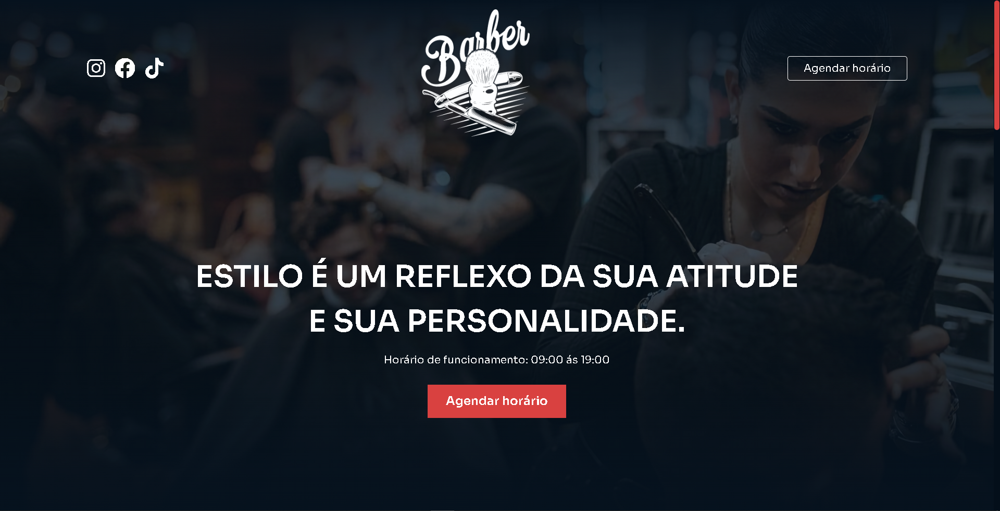
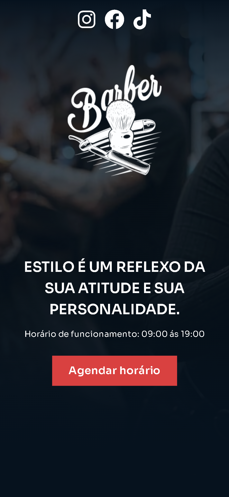

<h1 align="center"> Projeto Barbearia </h1>

  <a href="#-tecnologias">Tecnologias</a>&nbsp;&nbsp;&nbsp;|&nbsp;&nbsp;&nbsp;
  <a href="#-projeto">Projeto</a>&nbsp;&nbsp;&nbsp;|&nbsp;&nbsp;&nbsp;
  <a href="#-funcionalidades">Funcionalidades</a>&nbsp;&nbsp;&nbsp;&nbsp;&nbsp;&nbsp;

 

  

<!-- 

  
  

 -->

### 🚀 Tecnologias

Esse projeto foi desenvolvido com as seguintes tecnologias:

- HTML5
- CSS
- SCSS
- Git e Github

### 💻 Projeto

- [Acesse o projeto finalizado, online.](https://proj-barbearia-b1m0kr0cz-gabriellas-projects-9b13e380.vercel.app/)
    
Esse é um projeto Web Responsivo de uma Barbearia feita com HTML5, SCSS, CSS e bibliotecas externas.

### ⚙ Funcionalidades

- Projeto responsivo
- Animação ao atualizar e rolar a página
- Redirecionamento para o WhatsApp
- Scrollbar personalisado

---
